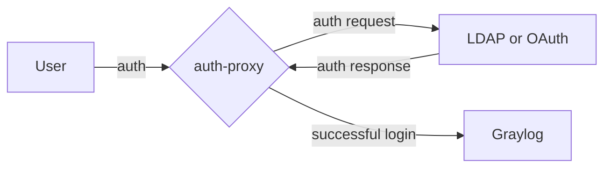
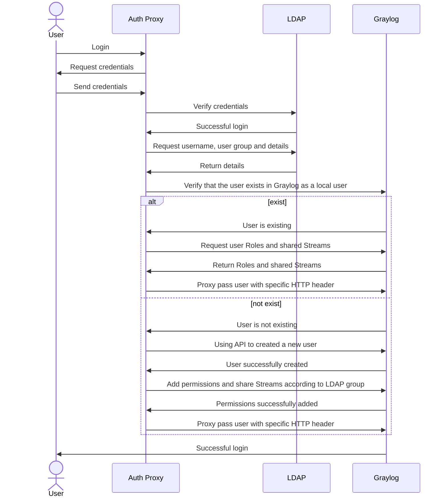
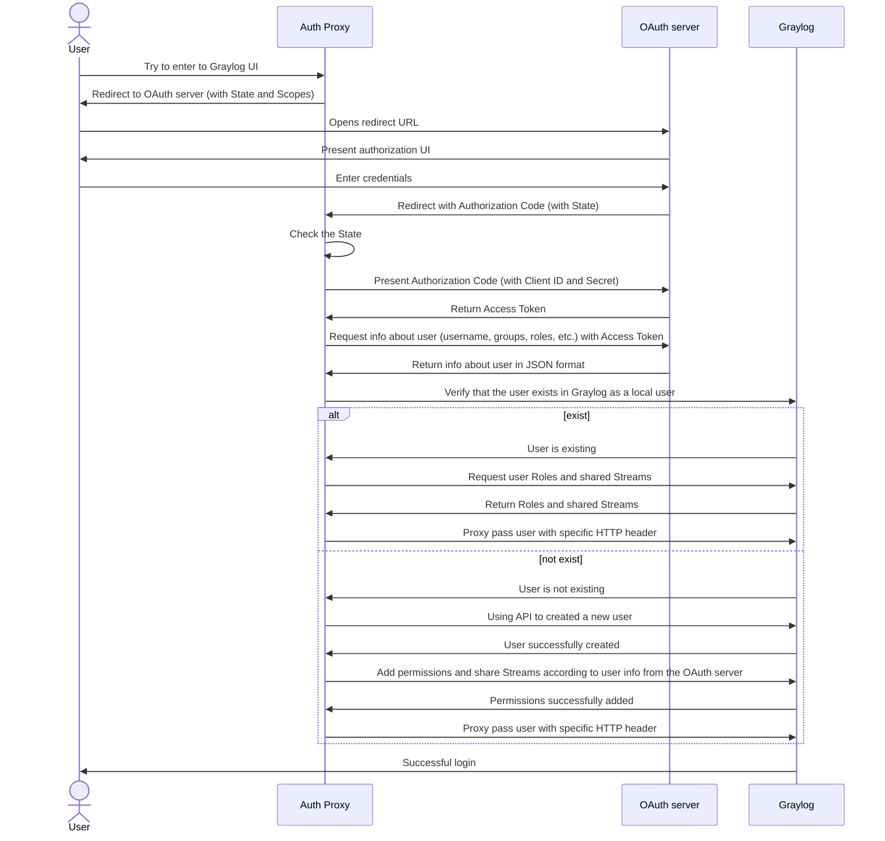

# qubership-graylog-auth-proxy

* [qubership-graylog-auth-proxy](#qubership-graylog-auth-proxy)
  * [Overview](#overview)
  * [Features](#features)
  * [How it works](#how-it-works)
  * [Authentication Priority](#authentication-priority)
    * [Priority Order](#priority-order)
    * [Authentication Flow Details](#authentication-flow-details)
      * [For Technical Users](#for-technical-users)
      * [For Super-Admin](#for-super-admin)
      * [For Regular Users](#for-regular-users)
    * [Security Considerations](#security-considerations)
  * [Parameters](#parameters)
    * [Technical users authentication examples](#technical-users-authentication-examples)
  * [Build](#build)
    * [Local build](#local-build)
  * [Debug](#debug)
    * [Visual Studio Code](#visual-studio-code)
  * [Tests](#tests)
    * [Coverage for tests](#coverage-for-tests)

## Overview

This is a proxy that allows you to authenticate users for the Graylog server using third-party databases
(for example, Active Directory) or OAuth authorization service (for example, Keycloak).



## Features

* Authentication and authorization based on: `LDAP`, `LDAPS`, `LDAP` with `StartTLS` protocols (`OpenLDAP`, `Active Directory`),
  `OIDC` + `OAuth 2.0`
* Proxy automatically creates user in Graylog with the same name as in the LDAP database or OAuth server
* Opportunity to create Graylog user with the certain roles according to group of the LDAP user or to role(-s)
  of the user from the OAuth2 server
* Opportunity to share Graylog streams to user according to their group in the LDAP database or to role(-s)
  of the user from the OAuth2 server
* Proxy creates users in the Graylog server with the random password to prevent authentication from bypassing the proxy.
  These passwords are rotated every `x` days (`3` by default) (available only for the LDAP mode at this moment)

## How it works

During working process graylog-auth-proxy connects to an SSO provider and handles all requests that are going to the
Graylog server. If user wants to access to the Graylog UI via the proxy, he/she needs to enter credentials for a user
from SSO provider. Then the proxy verifies these creds and adds user with the same username and random password
to Graylog and gives him the rights (attaches roles and shares several streams) based on the proxy configuration and
some attributes of the user from SSO provider. If the user is already exist in the Graylog, graylog-auth-proxy tries
to update it.

After successful authentication graylog-auth-proxy adds a trusted header with the username to each request that goes to
Graylog to avoid internal Graylog authentication. The proxy connect to LDAP only once and then uses cookies to identify
users for better performance. That mechanism work until cookies expired.

Regardless of this, the proxy runs the script for rotation of random passwords for users created in the Graylog and
deleting users that no longer exist in the SSO provider. This script runs every few days (3 days by default).

Also, graylog-auth-proxy have a metrics endpoint `/metrics` with Prometheus metrics.

LDAP mode:



OAuth2 mode:



## Authentication Priority

The proxy supports multiple authentication methods with the following priority:

### Priority Order

1. **Technical Users** (Basic Auth / Bearer Tokens) - **Highest Priority**
   * Configured via `--technical-users-basic-auth` and `--technical-users-static-tokens`
   * Used for API access, monitoring, and automated systems
   * Bypass OAuth/LDAP flows
   * Authenticate directly with the proxy using static credentials
   * No session management (authenticate on each request)

2. **Super-Admin User** (Basic Auth) - **Second Priority**
   * Default username: `admin` (configurable via `--graylog-pre-created-users`)
   * Bypasses OAuth/LDAP authentication
   * Credentials passed directly to Graylog for authentication
   * No session management or user creation
   * Graylog handles the authentication
   * Supports both legacy format and standard Basic Auth format:
     * Legacy: `Authorization: <base64(admin:password)>`
     * Standard: `Authorization: Basic <base64(admin:password)>`

3. **Regular Users** (OAuth / LDAP) - **Lowest Priority**
   * Authenticate through configured OAuth provider or LDAP
   * Session management with cookies
   * Automatic user creation in Graylog
   * Role and stream mapping based on OAuth/LDAP groups
   * Password rotation (LDAP mode only)

### Authentication Flow Details

#### For Technical Users

```bash
Request with Authorization header
  -> Check technical users credentials
  -> If valid: Allow access (no session)
  -> If invalid: Continue to next check
```

#### For Super-Admin

```bash
Request with Authorization: Basic admin:password
  -> Check if username is 'admin' (or other pre-created user)
  -> If yes: Pass credentials to Graylog (no OAuth/LDAP)
  -> If no: Continue to regular user flow
```

#### For Regular Users

```bash
OAuth Mode:
  Request without valid session
    -> Redirect to OAuth provider
    -> User authenticates
    -> Receive OAuth token
    -> Create/update user in Graylog
    -> Set session cookie
    -> Proxy requests with X-Forwarded-User header

LDAP Mode:
  Request with Authorization: Basic user:password
    -> Verify credentials with LDAP
    -> Create/update user in Graylog
    -> Set session cookie
    -> Proxy requests with X-Forwarded-User header
```

### Security Considerations

* **Authorization Header Handling**:
  * Admin users: Authorization header preserved and passed to Graylog
  * Regular users: Authorization header removed to prevent header spoofing
  * Technical users: Authenticated by proxy, then treated as regular users

* **X-Forwarded-User Header**:
  * Added only for non-admin users
  * Graylog trusts this header for authentication
  * Admin users don't get this header (uses Authorization instead)

## Parameters

Usage:

```bash
graylog_auth_proxy.py [OPTIONS]
```

Common options:

<!-- markdownlint-disable line-length -->
| Flag                      | Description                                                                                                   | Default         |
| ------------------------- | ------------------------------------------------------------------------------------------------------------- | --------------- |
| --config                  | Config file path                                                                                              | `./config.yaml` |
| --auth-type               | Defines which type of authentication protocol will be chosen (LDAP or OAuth 2.0). Allowed values: ldap, oauth | -               |
| --log-level               | Logging level. Allowed values: DEBUG, INFO, WARNING, ERROR, CRITICAL                                          | `INFO`          |
| --host                    | Host to bind                                                                                                  | `localhost`     |
| --port, -p                | Port to bind                                                                                                  | `8888`          |
| --metrics-port            | Port for Prometheus metrics                                                                                   | `8889`          |
| --proxy-tls-enabled       | Run proxy in secure HTTPS mode                                                                                | `false`         |
| --proxy-tls-cert-file     | Path to certificate file for proxy HTTP server                                                                | -               |
| --proxy-tls-key-file      | Path to private key file for proxy HTTP server                                                                | -               |
| --cookie                  | HTTP cookie name to set in                                                                                    | `authproxy`     |
| --domain                  | Domain for CORS Access-Control-Allow-Origin header (use '*' for all domains)                                  | `*`             |
| --access-control-max-age  | Max age for CORS preflight requests in seconds                                                                | `86400` (24h)   |
| --cookie-max-age          | Max age for session cookies in seconds                                                                        | `86400` (24h)   |
| --cookie-expires-hours    | Cookie expiration time in hours                                                                               | `24.0`          |
| --session-expiration-time | Session expiration time in seconds                                                                            | `86400` (24h)   |
| --requests-timeout        | A global parameter describes how many seconds to wait for the server to send data before giving up            | `30`            |
<!-- markdownlint-enable line-length -->

LDAP options:

<!-- markdownlint-disable line-length -->
| Flag                | Description                                                                 | Default                |
| ------------------- | --------------------------------------------------------------------------- | ---------------------- |
| --ldap-url          | LDAP URI to query                                                           | `ldap://localhost:389` |
| --http-realm        | HTTP auth realm                                                             | `Restricted`           |
| --ldap-starttls, -s | Establish a STARTTLS protected session                                      | ``false``              |
| --ldap-over-ssl     | Establish LDAP session over SSL                                             | `false`                |
| --disable-referrals | Sets ldap.OPT_REFERRALS to zero                                             | `false`                |
| --base-dn, -b       | LDAP base DN                                                                | -                      |
| --bind-dn, -D       | LDAP bind DN                                                                | -                      |
| --bind-password, -w | LDAP password for the bind DN                                               | -                      |
| --htpasswd          | Path to `htpasswd` file with LDAP password for the bind DN in Base64 format | -                      |
| --filter, -f        | LDAP filter                                                                 | `(cn=%(username)s)`    |
<!-- markdownlint-enable line-length -->

Graylog options:

<!-- markdownlint-disable line-length -->
| Flag                               | Description                                                                                | Default                                                                            |
| ---------------------------------- | ------------------------------------------------------------------------------------------ | ---------------------------------------------------------------------------------- |
| --role-mapping                     | Filter for mapping Graylog roles between LDAP and Graylog users by memberOf field          |                                                                                    |
| --stream-mapping                   | Filter for sharing Graylog streams between LDAP and Graylog users by memberOf field        |                                                                                    |
| --pre-created-users                | Comma separated pre-created users in Graylog for which you do not need to rotate passwords | `admin,auditViewer,operator,telegraf_operator,graylog-sidecar,graylog_api_th_user` |
| --rotation-pass-interval           | Interval in days between password rotation for non-pre-created users                       | `3`                                                                                |
| --graylog-host                     | Graylog host                                                                               | `http://127.0.0.1:9000`                                                            |
| --graylog-admin-user               | Existed Graylog with admin rights                                                          | `graylog_api_th_user`                                                              |
| --graylog-tls-ca-file              | Path to CA certificate file for connection to Graylog                                      |                                                                                    |
| --graylog-tls-cert-file            | Path to client certificate file for connection to Graylog                                  |                                                                                    |
| --graylog-tls-key-file             | Path to private key file for connection to Graylog                                         |                                                                                    |
| --graylog-tls-insecure-skip-verify | Allows skipping verification of certificate from Graylog server                            | `false`                                                                            |
<!-- markdownlint-enable line-length -->

OAuth options:

<!-- markdownlint-disable line-length -->
| Flag                       | Description                                                                                                                                                                                                                             | Default                      |
| -------------------------- | --------------------------------------------------------------------------------------------------------------------------------------------------------------------------------------------------------------------------------------- | ---------------------------- |
| --oauth-host               | OAuth2 authorization server host field                                                                                                                                                                                                  | `http://127.0.0.1:8080`      |
| --oauth-authorization-path | This path will be used to build URL for redirection to OAuth2 authorization server login page                                                                                                                                           |                              |
| --oauth-token-path         | This path will be used to build URL for getting auth token from OAuth2 authorization server                                                                                                                                             |                              |
| --oauth-userinfo-path      | This path will be used to build URL for getting information about current user from OAuth2 authorization server to get username and entities (roles, groups, etc.) for Graylog roles and streams mapping                                |                              |
| --oauth-redirect-uri       | URI to redirect after successful logging in on OAuth2 authorization server side                                                                                                                                                         | `http://localhost:8888/code` |
| --oauth-client-id          | OAuth2 Client ID for the proxy                                                                                                                                                                                                          |                              |
| --oauth-client-secret      | OAuth2 Client Secret for the proxy                                                                                                                                                                                                      |                              |
| --oauth-htpasswd           | Path to htpasswd file with Client Secret for the OAuth2 protocol in Base64 format                                                                                                                                                       |                              |
| --oauth-scopes             | OAuth2 scopes for the proxy separated by spaces. Configured for Keycloak server by default                                                                                                                                              | `openid profile roles`       |
| --oauth-user-jsonpath      | JSONPath (by jsonpath-ng) for taking username from the JSON returned from OAuth2 server by using userinfo path. Configured for Keycloak server by default                                                                               | `preferred_username`         |
| --oauth-roles-jsonpath     | JSONPath (by jsonpath-ng) for taking information about entities (roles, groups, etc.) for Graylog roles and streams mapping from the JSON returned from OAuth2 server by using userinfo path. Configured for Keycloak server by default | `realm_access.roles[*]`      |
<!-- markdownlint-enable line-length -->

Technical users options (works with both LDAP and OAuth):

<!-- markdownlint-disable line-length -->
| Flag                              | Description                                                                                                                                                                                           | Default | Example                                                |
| --------------------------------- | ----------------------------------------------------------------------------------------------------------------------------------------------------------------------------------------------------- | ------- | ------------------------------------------------------ |
| --technical-users-basic-auth      | Comma-separated list of technical users with Basic Auth credentials in format `username:password,username2:password2`. These users can authenticate using standard HTTP Basic Authentication.        |         | `monitoring:secret123,backup:pass456`                  |
| --technical-users-static-tokens   | Comma-separated list of technical users with static bearer tokens in format `username:token,username2:token2`. These users can authenticate using `Authorization: Bearer <token>` header.            |         | `api-client:abc123def456,telegraf:xyz789`              |
| --technical-users-roles           | Comma-separated list of Graylog roles assigned to technical users in format `username:role1,role2;username2:role3`. Use semicolons to separate users, commas to separate roles for the same user.   |         | `monitoring:Reader;api-client:Admin;backup:Reader,Admin` |
<!-- markdownlint-enable line-length -->

Auth provider TLS options (TLS configuration for both LDAP and OAuth):

<!-- markdownlint-disable line-length -->
| Flag                            | Description                                                                                 | Default |
| ------------------------------- | ------------------------------------------------------------------------------------------- | ------- |
| --auth-tls-ca-file              | Path to CA certificate file for LDAP server or OAuth authentication server                  |         |
| --auth-tls-cert-file            | Path to client certificate file for LDAP server or OAuth authentication server              |         |
| --auth-tls-key-file             | Path to private key file for LDAP server or OAuth authentication server                     |         |
| --auth-tls-insecure-skip-verify | Allows skipping verification of certificate from LDAP server or OAuth authentication server | false   |
<!-- markdownlint-enable line-length -->

You can set each parameter that has a non-short flag at the config file (except `--config` parameter).

### Technical users authentication examples

Basic Auth:

```bash
curl -u monitoring:secret123 https://graylog.example.com/api/system/metrics
```

Bearer Token:

```bash
curl -H "Authorization: Bearer abc123def456" https://graylog.example.com/api/system/metrics
```

## Build

### Local build

To build the docker container locally, you need:

* docker

To execute build just run the command:

```bash
docker build .
```

Or using the Makefile:

```bash
make build
```

## Debug

The `graylog-auth-proxy` is using the `python-ldap` to work with LDAP. Currently this library can't be installed
on Windows. So you need to use Linux or WSL2.

Requirements:

* Linux or WSL2
* Python >= 3.12
* venv
* External LDAP or IDP

Firstly need to create `venv`:

```bash
python -m venv .venv
```

and activate `venv`:

```bash
source .venv/bin/activate
```

Next, need to install requirements in created `venv`:

```bash
python -m pip install -r requirements.txt
```

Or using the Makefile (creates the `venv` automatically):

```bash
make install
```

Next, to run `graylog-auth-proxy` you need the config file or set parameters using the CLI args.
You can copy config file fro examples and next fill it:

```bash
mkdir test/
cp examples/oauth2-config.yaml test-run/config.yaml
```

Next, you need fill `config.yaml`. For OAuth2 client-secret or password for client should save in `htpasswd` file.
To generate it you can use the script

```bash
./scripts/make_htpasswd.sh
```

### Visual Studio Code

Config for Visual Studio Code to run this proxy locally:

```json
{
    // Use IntelliSense to learn about possible attributes.
    // Hover to view descriptions of existing attributes.
    // For more information, visit: https://go.microsoft.com/fwlink/?linkid=830387
    "version": "0.2.0",
    "configurations": [
        {
            "name": "Python Debugger: Current File",
            "type": "debugpy",
            "request": "launch",
            "program": "${workspaceFolder}/src/graylog_auth_proxy.py",
            "args": [
                "--config=test-run/config.yaml"
            ],
            "console": "integratedTerminal"
        }
    ]
}
```

## Tests

The easiest way to run tests is via the Makefile (no system LDAP libraries required):

```bash
make test
```

This automatically creates a `venv`, installs test dependencies, and runs pytest.

Alternatively, using a manually managed `venv`:

```bash
source .venv/bin/activate
python -m pip install -r test-requirements.txt
python -m pytest -v tests/
```

Or use an IDE to run tests.

### Coverage for tests

To calculate and show test coverage:

```bash
make test-coverage
```

Or manually:

```bash
coverage run -m pytest -v tests/ && coverage report -m
```
